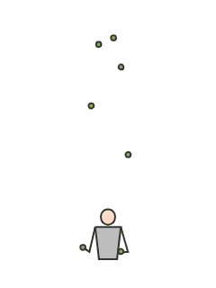
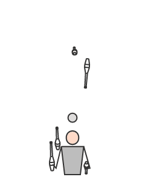
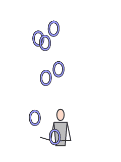

# SiteswapJS Twitch integration

### Setup
Change the login credentials for your bot in `botlogin.js`. Generate oauth here: https://twitchapps.com/tmi/

Add `twitch.html` as a browser source in OBS.

If hosting this online, make sure to protect the directory to not reveal your bots login credentials.

### Usage
`!ss <siteswap> <prop>`

Possible props: b, c, r or any Twitch emote. (No prop = defaults to balls)

Examples:
  
`!ss 5` (Juggles a 5 ball cascade with the default prop, balls)
  
`!ss 441 PogChamp` (Juggles 441 with PogChamp emotes)
  
`!ss 97531 c` (Juggles 97531 with clubs)
  
### To do
  * Siteswap validation
  * Rotate juggler if the prop is rings
  * Make it work by only including `ss.js` or `ss.min.js` instead of all source files separately
  

# SiteswapJS (Original readme) #

A Javascript library for siteswap juggling animations.

### Example Animations





### Development

After cloning this repo, run `npm install`, then `npm start` to run a local server with the animator in a sandbox on `http://localhost:7531/`.

### Usage

Include `ss.js` or `ss.min.js` in your project and then:

```
animator = new SiteswapJS(canvasId, siteswap, options);
animator.start();
```

Where `canvasId` in the id of a HTML canvas, `siteswap` is a string of the siteswap to animate and `options` is an object with properties from:

Option | Type | Default | Description
--- | --- | --- | ---
propType | `b`, `c` or `r` | b | Which prop to use: b = balls, c = clubs, r = rings
throwsPerSecond | Float | 3 | How many beats per second
headBounce | Boolean | `false` | Whether the juggler should be performing a headbounce
clubBalance | Boolean | `false` | Whether the juggler should be performing a club balance
spinOn0s | Boolean | `false` | When `true`, the juggler pirouettes 360 degrees for each two consecutive 0 beats
spinOn2s | Boolean | `false` | When `true`, the juggler pirouettes 360 degrees for each two consecutive 2 beats
debug | Boolean | `false` | When `true`, shows additional debugging information on the canvas
controls | Boolean | `false` | Whether to add mouse and touch listeners to the canvas for rotating the juggler
